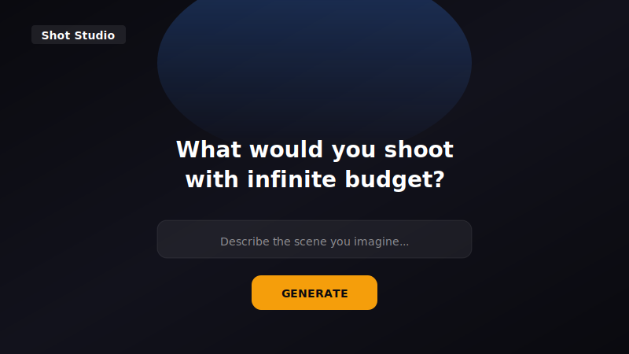

<p align="center">
  
</p>

<p align="center">
  <strong>Cinematic AI image generator</strong> — Director-style controls, film stock presets, voice input, and a local gallery.
</p>

<p align="center">
  <a href="https://nextjs.org"></a>
  <a href="https://www.typescriptlang.org"></a>
  <a href="https://tailwindcss.com"></a>
  <a href="https://replicate.com/black-forest-labs/flux-schnell"></a>
</p>

---

## ✨ What it does

One prompt, one click — get a **cinematic frame** that looks like it cost a fortune. Not just a prompt box: **focal length**, **aperture**, and **film stock** (Kodak 5219, Noir, Neon, etc.) are baked into the prompt so the model outputs real film-style frames.

| Feature | Description |
|--------|-------------|
| 🎞️ **Templates** | One-click prompts: fantasy battle, heist, sci‑fi, noir, romance, documentary |
| 🎬 **Film stock** | Neutral, Kodak 5219, Fuji Eterna, Noir, Bleach Bypass, Vintage, Neon/Synth |
| 📝 **Director's note** | Optional lighting/mood line (e.g. *Golden hour, backlit*) |
| 📷 **Camera** | Focal length 24–135mm · Aperture f/1.4–f/8 · Aspect 16:9, 21:9, 9:16, 1:1, 4:5 |
| 🎤 **Voice input** | Describe by voice — browser speech-to-text appends to the prompt |
| 🔢 **Seed** | Optional seed for reproducibility; last seed shown on result |
| ⌨️ **Shortcut** | **⌘↵** / **Ctrl+Enter** to generate |
| 🖼️ **Gallery** | Last 24 shots in the browser (localStorage), lightbox, “Use this shot” |

---

## 🖼️ UI

<p align="center">
  
</p>

*Dark theme, glass panels, Framer Motion. Result panel: REGENERATE · DOWNLOAD · COPY LINK · NEW SHOT.*

---

## 🚀 Quick start

```bash
git clone https://github.com/riyanmohmmeed-dev/shot-studio.git
cd shot-studio
npm install
cp .env.local.example .env.local   # add your REPLICATE_API_TOKEN
npm run dev
```

Open **http://localhost:3000**.

- Get an API token: [replicate.com/account/api-tokens](https://replicate.com/account/api-tokens)  
- You need [Replicate credit](https://replicate.com/account/billing#billing) to generate images.

> ⚠️ **Never commit `.env.local`** — it’s in `.gitignore`.

---

## 🛠 Tech stack

| Layer | Stack |
|-------|--------|
| **Framework** | Next.js 14 (App Router), TypeScript |
| **Styling** | Tailwind CSS (custom tokens: void, glass, accent) |
| **Motion** | Framer Motion |
| **AI** | Replicate — FLUX Schnell (prompt, aspect_ratio, megapixels, seed) |

---

## 📁 Structure

```
shot-studio/
├── app/
│   ├── api/generate/route.ts   # POST → image URL + seed
│   ├── layout.tsx, page.tsx, globals.css
├── components/
│   ├── Nav, Hero, PromptInput, PromptTemplates, DirectorNote
│   ├── FilmStockPresets, CameraControls, QualityAndSeed, VoiceInput
│   ├── ResultPanel, Gallery, Onboarding
├── lib/
│   ├── buildPrompt.ts          # Cinematic + film stock + director note
│   ├── promptTemplates.ts, galleryStorage.ts
├── assets/
│   ├── hero.svg, screenshot-ui.svg
└── README.md
```

---

## 👀 For recruiters

- **Product** — Camera and film semantics mapped into prompt engineering; templates and voice for fast iteration.
- **Full-stack** — Next.js API route, env handling, client state, localStorage gallery, 402/billing UX.
- **Design** — Dark theme, glass panels, motion, onboarding, responsive.
- **API** — Replicate with seed, quality, and clear errors (e.g. “Add credit” link on 402).

---

## 📄 License

MIT.
